# Rapport de Projet DevOps : Déploiement Automatisé d'une Application Web

## Introduction
Ce rapport détaille la conception, l'automatisation et le déploiement d'une application web de bout en bout. L'objectif était de mettre en place une infrastructure cloud, de la configurer de manière automatisée, de conteneuriser l'application, et d'établir un pipeline d'Intégration et de Déploiement Continus (CI/CD). 

Les technologies clés utilisées sont :
* **Terraform** pour l'Infrastructure as Code (IaC) sur AWS.
* **Ansible** pour la gestion de la configuration.
* **Docker** pour la conteneurisation.
* **Kubernetes (K3s)** pour l'orchestration des conteneurs.
* **GitHub Actions** pour le pipeline CI/CD.

---

## Étape 1 : Provisionnement de l'Infrastructure AWS (Terraform)
La première étape a consisté à coder l'infrastructure AWS à l'aide de Terraform pour s'assurer que sa création soit reproductible, versionnée et documentée.

**1. Initialisation de Terraform :**
```bash
terraform init
```
*Explication :* Cette commande télécharge les plugins nécessaires (le "provider" AWS) pour que Terraform puisse communiquer avec l'API d'Amazon Web Services.
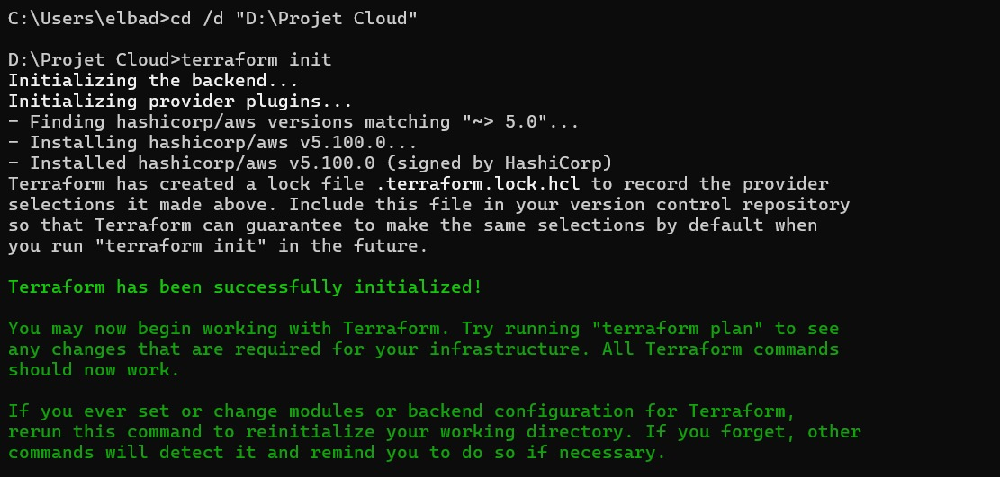

**2. Planification (*Dry-Run*) :**
```bash
terraform plan
```
*Explication :* Terraform génère un plan d'exécution détaillant toutes les ressources qui seront créées : 2 instances EC2 (`t3.micro` avec 1 Go de RAM gratuites) et un groupe de sécurité ouvrant les ports 22 (SSH), 5000 (Flask), 6443 (API Kubernetes) et 30001 (NodePort K8s).
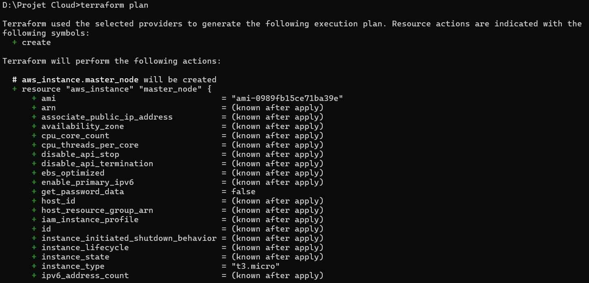

**3. Application de l'infrastructure :**
```bash
terraform apply -auto-approve
```
*Explication :* Les ressources sont effectivement créées sur AWS de manière automatique et les adresses IP publiques sont générées.
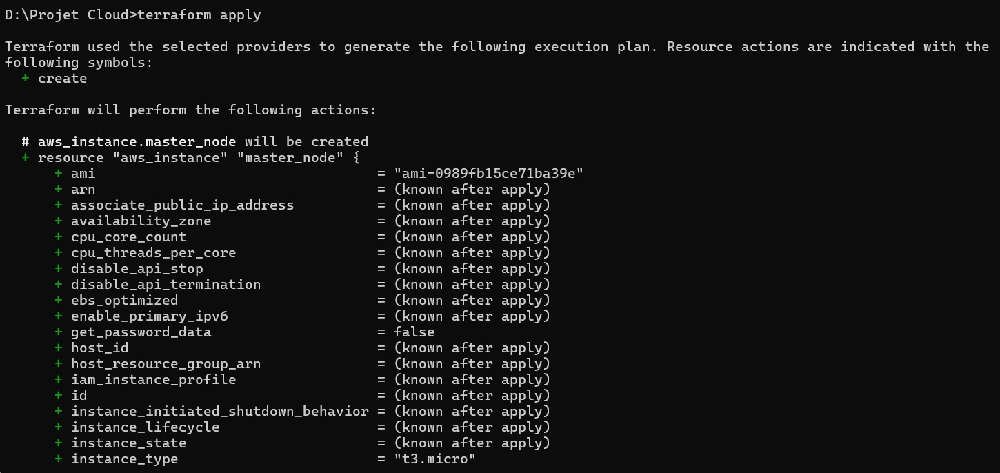

---

## Étape 2 : Configuration Automatisée des Serveurs (Ansible)
Une fois les machines virtuelles créées, il a fallu les configurer sans intervention manuelle répétitive.

Nous avons d'abord testé la connexion SSH classique avec notre clé `.pem` :
```bash
ssh -i projet-devops-key.pem ubuntu@<IP_MASTER>
```
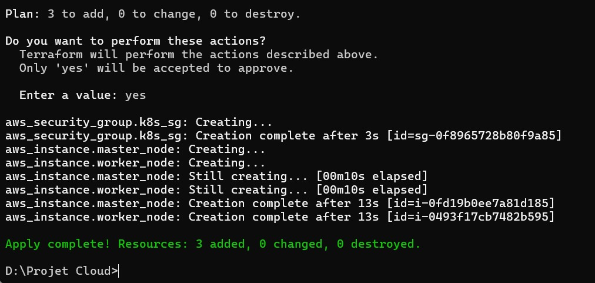

**1. Installation et Validation d'Ansible :**
Sur la machine de contrôle, nous avons installé Ansible et configuré les droits d'accès.
```bash
sudo apt install ansible -y
chmod 400 projet-devops-key.pem
```
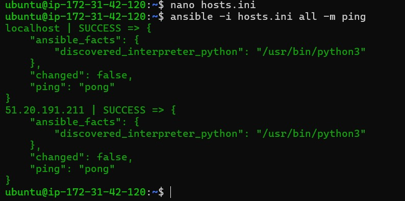
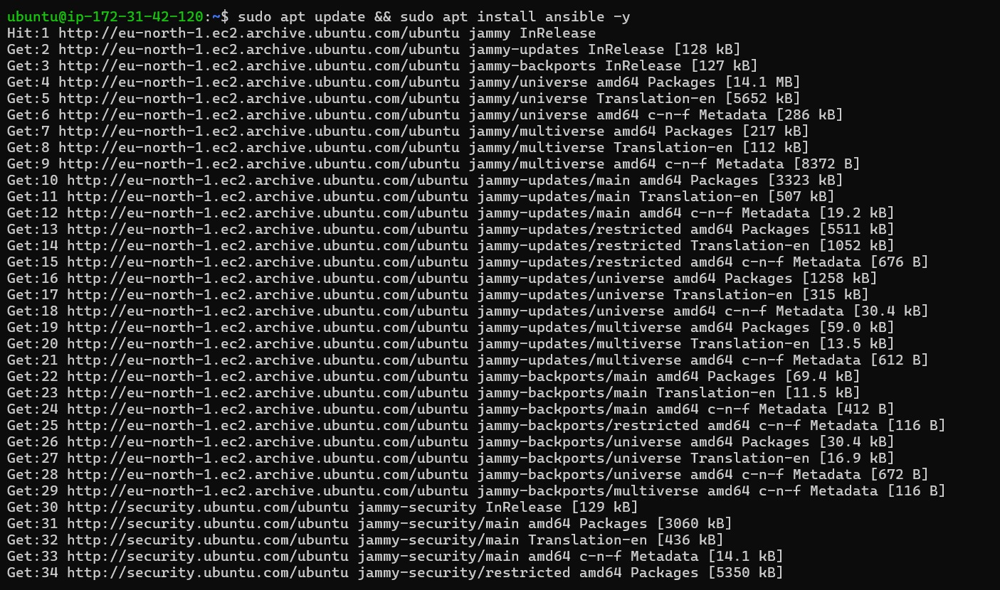

**2. Test de connectivité (Ping) :**
Nous avons listé nos serveurs dans un fichier `hosts.ini` puis testé la connexion :
```bash
ansible -i hosts.ini all -m ping
```
*Explication :* Demande à Ansible de se connecter à toutes les machines de l'inventaire et de renvoyer un "pong" si l'accès SSH et Python fonctionnent.
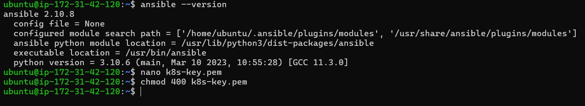

**3. Exécution du Playbook de configuration :**
```bash
ansible-playbook -i hosts.ini setup_infrastructure.yml
```
*Explication :* Ansible lit le ficher YAML et va automatiquement : installer K3s (Kubernetes allégé), installer Docker, et surtout **créer 1 Go de Swap** (fichier d'échange sur le disque dur) car nos instances AWS n'ont que 1 Go de RAM, ce qui est insuffisant pour faire tourner Kubernetes nativement de manière stable.
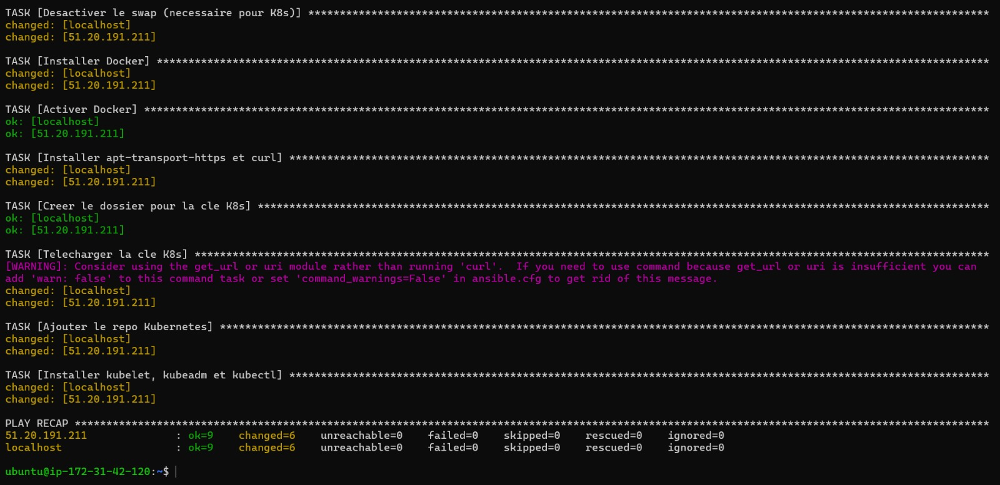

---

## Étape 3 : Orchestration des Conteneurs (Kubernetes / K3s)
Au lieu d'utiliser le lourd `kubeadm` (qui réclame 1,7 Go de RAM), nous avons opté pour **K3s**, une distribution Kubernetes certifiée et très légère, idéale pour les instances Cloud gratuites (t3.micro).

*(Historique : Lors d'un premier essai avec kubeadm, une erreur bloquante liée à la RAM s'est produite, nécessitant l'utilisation du flag `--ignore-preflight-errors=Mem` avant notre bascule salvatrice sur K3s).*
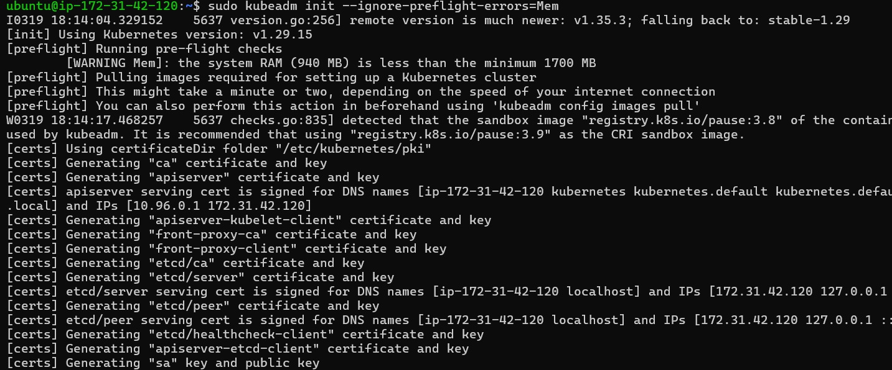

Une fois Kubernetes installé par Ansible, la configuration d'un réseau de Pods a été assurée (Flannel/Traefik).
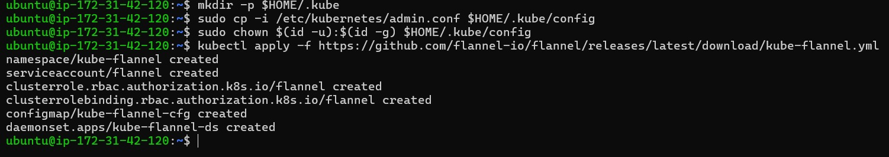
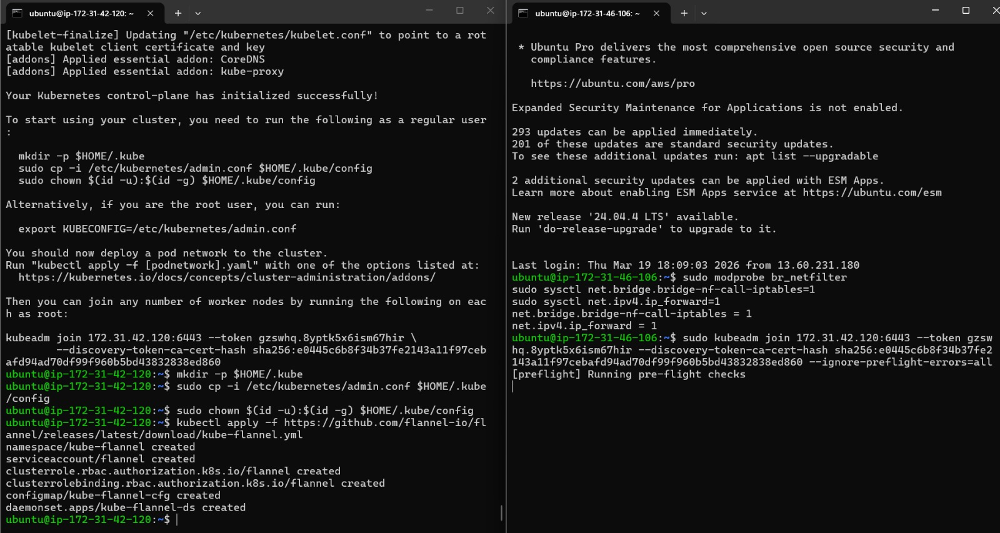

**1. Déploiement de l'Application Flask :**
Nous avons écrit un manifeste Kubernetes `flask-app.yaml` contenant un `Deployment` (Gérant notre image Docker `aymanelbadry/flask-devops-app:latest`) et un `Service` (Mode NodePort pour exposer l'application sur le port réseau `30001`).

```bash
kubectl apply -f flask-app.yaml
```
*Explication :* Cette commande envoie la configuration au Master Kubernetes qui va instantanément télécharger l'image depuis Docker Hub et démarrer le conteneur.

---

## Étape 4 : Pipeline CI/CD (GitHub Actions)
Pour couronner le projet, nous avons totalement supprimé le besoin d'intervenir sur les serveurs manuellement lors d'une mise à jour de code (ex: Modification de la page HTML `index.html` ou du code python `app.py`).

**1. Stockage des Secrets :**
Sous GitHub (Paramètres > Secrets), nous avons entré les mots de passe Docker Hub, l'IP de la machine AWS et la Clé SSH privée AWS.
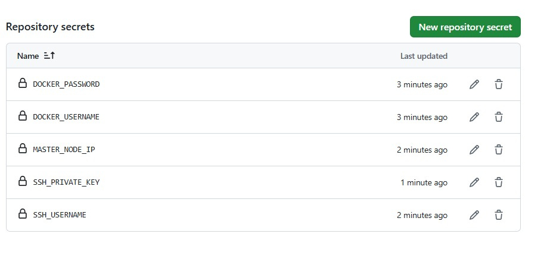

**2. Déclenchement du Workflow :**
Dès que nous tapons les commandes Git suivantes sur notre terminal développeur :
```bash
git add .
git commit -m "Mise à jour de l'interface"
git push
```
Le pipeline `.github/workflows/deploy.yml` est déclenché sur les serveurs de GitHub. 

**3. Les Commandes exécutées par le Pipeline :**
Le pipeline exécute virtuellement ces commandes pour nous :
```bash
# 1. Pipeline "Job Build" : Construit l'image Docker à partir du Dockerfile
docker build -t aymanelbadry/flask-devops-app:latest .

# 2. Pipeline "Job Push" : Envoie la nouvelle image sur le référentiel Docker Hub public
docker push aymanelbadry/flask-devops-app:latest

# 3. Pipeline "Job Deploy" : Se connecte en SSH au serveur AWS et exécute :
sudo kubectl rollout restart deployment/flask-app
```
*Explication de la dernière commande :* C'est la magie du **"Zero Downtime Deployment"**. Kubernetes crée un nouveau conteneur en arrière-plan avec le nouveau code fraîchement poussé, attend qu'il soit prêt, puis supprime l'ancien conteneur sans que l'utilisateur Web ne subisse la moindre micro-coupure de réseau.

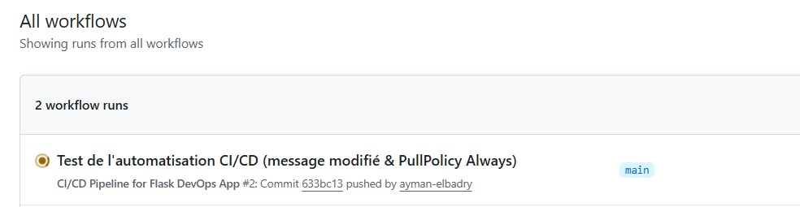

---

## Étape 5 : L'interface Graphique Modernisée
Lors de la toute dernière phase, une interface HTML/CSS "Glassmorphism" a été ajoutée. Le fichier `Dockerfile` a été révisé avec la commande :
```dockerfile
COPY . .
```
Cela a permis d'embarquer récursivement les dossiers `templates` et `static` de Flask dans l'image Docker. L'envoi de ce code sur GitHub a automatiquement déclenché le CI/CD, et l'interface Web est soudainement passée d'un simple texte JSON brute à une page web dynamique complète, validant l'ensemble de notre architecture DevOps.

## Conclusion
Ce projet a permis de réunir tous les fondamentaux de la culture DevOps. 
Nous sommes passés d'un simple code Python à un service entièrement conteneurisé, déployé sur une infrastructure Cloud provisionnée automatiquement par du code (Terraform). L'administration système a été standardisée par Ansible. Enfin, le cycle de vie du code a été clôturé par un pipeline CI/CD moderne, permettant de livrer du code de bout en bout automatiquement, effaçant ainsi les barrières entre le Développement et les Opérations.
